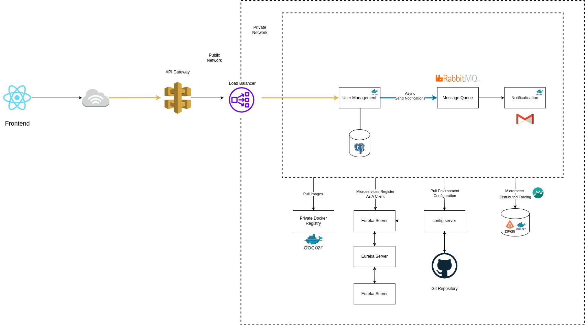

# Clinicwave Backend

A microservices-based backend platform for the Clinicwave healthcare management system, built with Spring Boot.

## Project Overview

This project consists of two main microservices:

1. [User Management Service](./user-management-service/README.md)
2. [Notification Service](./notification-service/README.md)

## Architecture

The system follows a microservices architecture where each service is responsible for a specific domain of functionality:



### User Management Service
- Handles user authentication and authorization
- Manages user profiles and roles
- Provides JWT-based security
- RESTful API endpoints for user operations

### Notification Service
- Handles all notification-related functionality
- Processes email notifications
- Integrates with RabbitMQ for message queuing
- Supports template-based email content

## Technology Stack

- Java 21
- Spring Boot 3.x
- Spring Security with JWT
- Spring Data JPA
- PostgreSQL
- RabbitMQ
- Spring Mail
- Thymeleaf
- Maven
- Docker & Docker Compose

## Getting Started

### Prerequisites

- Java 21 or later
- Maven 3.6 or later
- Docker and Docker Compose (optional, for containerized infrastructure)
- SMTP server for email notifications

### Docker Compose Setup

The project includes a `docker-compose.yml` file that sets up the required infrastructure services:

```bash
# Start all infrastructure services
docker-compose up -d

# Stop all services
docker-compose down
```

This will start the following services:
- **PostgreSQL** (v16.8)
  - Port: 5432
  - Database: user_management_db
  - Username: postgres
  - Password: postgres

- **Redis** (v7.4.2)
  - Port: 6379
  - Used for caching and session management

- **RabbitMQ** (v4.0 with Management UI)
  - Message Broker Port: 5672
  - Management UI Port: 15672
  - Default credentials: guest/guest

All services are connected through a Docker network named `app_network` and have persistent volumes for data storage.

### Running the Services

1. Clone the repository:
   ```bash
   git clone https://github.com/aamirxshaikh/clinicwave-backend.git
   cd clinicwave-backend
   ```

2. Set up the database:
   - If using Docker Compose, the database will be automatically created
   - If running locally, create a PostgreSQL database named `user_management_db`
   - Configure database credentials in `user-management-service/src/main/resources/application.properties`

3. Configure RabbitMQ:
   - If using Docker Compose, RabbitMQ will be available at localhost:5672
   - If running locally, ensure RabbitMQ is running or update the connection details in `notification-service/src/main/resources/application.properties`

4. Configure Email Settings:
   - Update SMTP server details in `notification-service/src/main/resources/application.properties`

5. Build and run the services:

   For User Management Service:
   ```bash
   cd user-management-service
   mvn spring-boot:run
   ```

   For Notification Service:
   ```bash
   cd notification-service
   mvn spring-boot:run
   ```

## Service Communication

The services communicate through:
- REST APIs for synchronous communication
- RabbitMQ for asynchronous communication (notifications)

## Development

### Project Structure

```
clinicwave-backend/
├── user-management-service/    # User Management microservice
│   ├── src/
│   ├── pom.xml
│   └── README.md
│
├── notification-service/       # Notification microservice
│   ├── src/
│   ├── pom.xml
│   └── README.md
│
└── docker-compose.yml         # Infrastructure services configuration
```

### Building the Project

To build all services:
```bash
mvn clean install
```

### Running Tests

To run tests for all services:
```bash
mvn test
```

### Postman Documentation

- [Postman Guide](./postman/POSTMAN_GUIDE.md) - Contains instructions on how to import and use the Postman collection
  for testing API endpoints.
- [Postman Collection](./postman/Clinicwave_API.postman_collection.json) - A Postman collection with pre-configured API
  requests for easy testing of the User Management Service.

[//]: # (## API Documentation)

[//]: # ()
[//]: # (### User Management Service)

[//]: # (- Base URL: `http://localhost:8080`)

[//]: # (- API Version: v1)

[//]: # (- Swagger UI: `http://localhost:8080/swagger-ui.html`)

[//]: # ()
[//]: # (### Notification Service)

[//]: # (- Base URL: `http://localhost:8081`)

[//]: # (- API Version: v1)

[//]: # (- Swagger UI: `http://localhost:8081/swagger-ui.html`)

## Security

The system implements:
- JWT-based authentication
- Role-based authorization
- Secure password handling
- CORS configuration

## Monitoring and Logging

Each service includes:

[//]: # (- Spring Boot Actuator endpoints)
- Logging configuration

[//]: # (- Health check endpoints)

## Contributing

1. Fork the repository
2. Create a feature branch
3. Commit your changes
4. Push to the branch
5. Create a Pull Request

[//]: # (## License)

[//]: # ()
[//]: # (This project is licensed under the MIT License - see the LICENSE file for details.)

## Support

For support, please open an issue in the repository. 